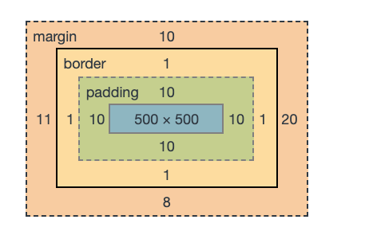
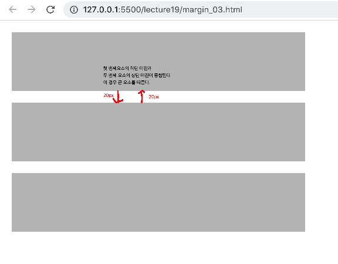

## 테두리속성으로 원 그리기 
```html
<div class="circle">
    Circle
</div>
```
```css
.circle {
    width: 300px;
    height: 300px;
    border:1px solid red;
    text-align: center;
    line-height: 300px;
    
    background-color: greenyellow;
    /* border-radius: 150px; */
    border-radius: 50%; /* 높이의 50% */
}
```

## 꼭지점의 radius를 가로방향과 세로방향 다르게 지정 
```css
p { 
    width: 500px;
    border: 2px solid red;
    padding: 20px;
    border-top-right-radius: 50px 25px;
    /* 가로 50px 세로 25px 만큼 radius된다. */

    border-radius: 50px / 25px;
    /* 사방으로 가로50px 25px 만큼 radius된다.  */
}
```

## 패딩 지정
```css
div {
    width: 300px;
    height: 200px;
    border: 1px solid red; 
    /* 시계방향 */
    padding: 10px 30px 40px 15px;
}

/* padding: 10px 30px 40px 15px; 다음과 동일하다.*/
div {
    padding-top: 10px; 
    padding-right: 30px;
    padding-bottom: 40px;
    padding-left: 15px;
}
```

## 마진 지정 
- 요소의 너비는 border까지이다. 
- 마진으로 요소의 간격을 지정한다. 
```css
div {
    width: 500px; height: 500px;
    background-color: seagreen;
    border : 1px solid red; 
    padding: 10px; 
    
        /* 요소의 너비는 border까지 이다. */
        margin: 40px;        
}
```

- 마진을 나누어 지정
```css
div{
    margin-top: 10px;
    margin-right: 20px ;
    margin-bottom: 8px;
    margin-left: 11px;
}

```
<center>
 
</center>

- auto 속성 
```css
div {
    width: 300px;
    border: 2px solid red;
    background-color: yellow;
    padding: 10px ; 

    /* 브라우저 창의 크기에 맞추어 가운데 정렬된다. */
    margin: auto;
}
```

<center>
    
</center>

- 마진 중첩 
- 요소들 간에 마진이 중첩되는 경우 더 큰쪽이 적용된다. 
```html{
<div class="box"></div>
<div class="box"></div>
<div class="box"></div>
}
```
```css
.box{
    background-color: silver;
    width: 500px;
    height: 100px;
    margin: 20px;
}
```
<center>
    
</center>
