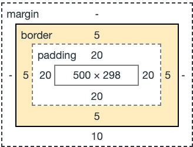
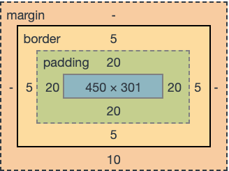

## box-sizing 
- 기본 값 
```html
<div class="boxModel">
    <p>dummy text</p>
</div>
<div class="boxModel two">
    <p>dummy text</p>
</div>

```
```css
.boxModel{
    box-sizing: content-box; /* 기본값 : width로 지정한 값은 컨텐츠의 크기가 된다. .*/
    width: 500px;
    border: 5px solid red; 
    padding: 20px; 
    /* 요소 크기의 너비는 550px이 된다. */
}

.two{
    box-sizing: border-box; /* width로 지정한 값은 border까지의 크기이다.   */
    /* 500px 내에서 border, padding 값이 모두 포함된다. */
}
```
- 첫번째 박스의 요소 크기 : 550px
<br><br>

- 두 번째 박스의 요소 크기 : 500px
<br><br>


